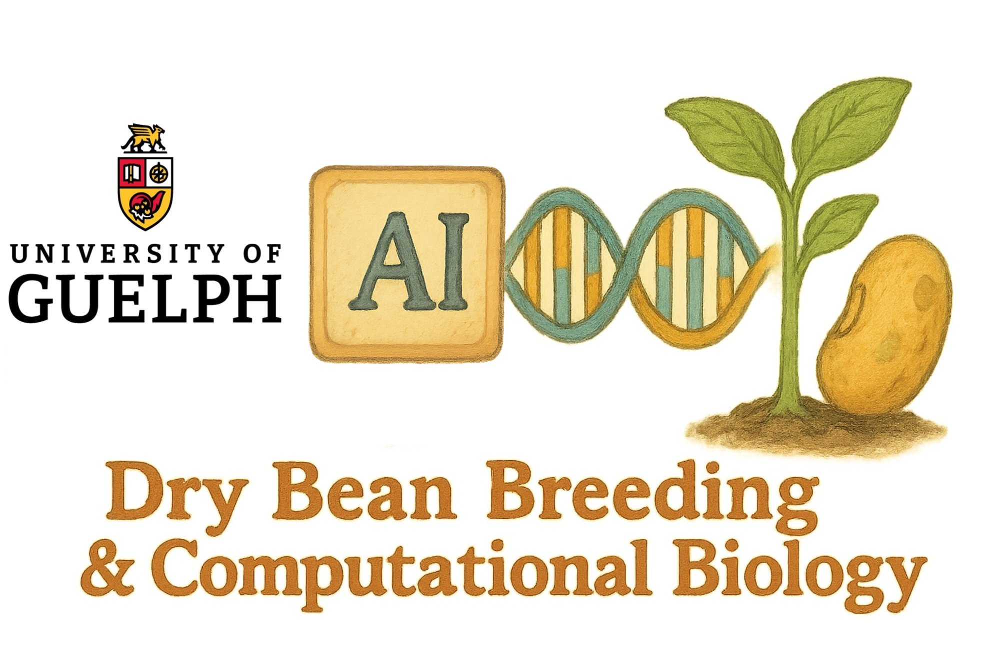

<p align="center">
  
</p>

<h1 align="center">AllInOne Phenomics</h1>

<p align="center">
  <b>Dry Bean Breeding & Computational Biology · University of Guelph</b><br/>
  <a href="https://www.uogbeans.com">www.uogbeans.com</a> · 
  <a href="mailto:myoosefz@uoguelph.ca">myoosefz@uoguelph.ca</a>
</p>

<p align="center">
  
  
  
  
</p>

---

## Overview

**AllInOne Phenomics** is a comprehensive drone image analysis platform for high-throughput phenotyping of dry bean field trials. It provides a complete end-to-end pipeline — from raw RGB or multispectral drone imagery to vegetation index extraction, spatial heatmaps, statistical analysis, genotype ranking, and machine learning prediction — all within a single interactive Shiny application.

> *"By integrating advanced technologies with traditional breeding, we aim to deliver dry bean cultivars that support sustainable agriculture and meet the needs of growers and industry."*
> — Dry Bean Breeding & Computational Biology Program, University of Guelph

---

## Features

| Module | Description |
|--------|-------------|
| 📷 **Dual Camera Support** | RGB and Multispectral (MicaSense) with auto band-scaling to reflectance |
| 🌿 **20+ Vegetation Indices** | Built-in library + unlimited custom formula builder |
| 🗺️ **Interactive Plot Grid** | Click 4 field corners to define grid; 1-based numbered plots |
| 🌡️ **Field Heatmaps** | Per-plot polygon choropleth with metadata hover (Plotly) |
| 📊 **Statistics** | Distributions, violin plots, outlier detection, genotype comparison |
| 🔗 **Correlation Analysis** | Pearson/Spearman/Kendall matrix + interactive scatter |
| 🧬 **PCA & Clustering** | Score biplot, scree plot, loadings, hierarchical dendrogram |
| 🏆 **Genotype Selection** | Threshold-based multi-index ranking with Elite/Standard categories |
| 🤖 **Machine Learning** | 12 algorithms (RF, XGBoost, SVM, GBM, nnet, …), hyperparameter tuning, RFE |
| 🔍 **Data QC** | Completeness heatmap, outlier detection, value range checker |
| 📡 **Spectral Signatures** | Mean reflectance curves per genotype/group across bands |
| 📑 **Report Generator** | Auto-generated HTML report with embedded plots and tables |
| 💾 **Export** | CSV, Excel (6 sheets), PNG/PDF plots, ranked plot list |

---

## Quick Start

### Run directly from GitHub (no installation needed beyond R)

```r
# Step 1 — install packages (run ONCE)
source("https://raw.githubusercontent.com/MohsenYN/AllInOne-Phenomics/main/install_packages.R")

# Step 2 — launch the app
shiny::runGitHub("AllInOne-Phenomics", "MohsenYN")
```

### Run locally from downloaded files

```r
# Step 1 — install packages (run ONCE)
source("install_packages.R")

# Step 2 — launch
shiny::runApp("app.R")
```

---

## Repository Structure

```
AllInOne-Phenomics/
├── app.R                          # Main Shiny application (~4700 lines)
├── DESCRIPTION                    # Package manifest for rsconnect
├── install_packages.R             # Installs all dependencies (run once)
├── deploy_to_shinyapps.R          # One-click deploy to shinyapps.io
├── README.md                      # This file
├── www/
│   └── logo.png                   # Lab logo (required for sidebar)
```

---

## Analysis Pipeline

```
Upload .tif mosaic
       ↓
Camera Configuration (RGB / Multispectral, band scaling)
       ↓
Soil Masking (BGI / HUE / ExG / NDVI)
       ↓
Plot Grid (click 4 corners or full-extent)
       ↓
Vegetation Indices (20+ built-in + custom formulas)
       ↓
┌──────────────────────────────────────┐
│  Field Maps  │  Statistics  │  QC   │
│  Correlation │  PCA         │  Spec │
│  Genotype Selection & Ranking        │
│  Machine Learning (12 algorithms)    │
│  Report Generator                    │
└──────────────────────────────────────┘
       ↓
Export (CSV / Excel / HTML Report)
```

---

## Supported Vegetation Indices

**RGB:** NDVI*, GNDVI*, CCI, EGVI, ERVI, GBI, GD, GLAI, GR, MGVRI, NB, NG, NGBDI, NR, RB, RI, SAVIrgb, NGRDI, BGI, RBG, RGR

**Multispectral:** NDVI, NDRE, GNDVI, SAVI, EVI, RVI, OSAVI, CIre, MSAVI, RDVI, MCARI, WDRVI

*_Requires NIR band assignment_

---

## Machine Learning Algorithms

| Algorithm | caret method |
|-----------|-------------|
| Random Forest | `rf` |
| Gradient Boosting | `gbm` |
| XGBoost | `xgbTree` |
| SVM Radial | `svmRadial` |
| SVM Linear | `svmLinear` |
| Neural Network | `nnet` |
| Elastic Net | `glmnet` |
| k-Nearest Neighbours | `kknn` |
| Decision Tree | `rpart` |
| Naive Bayes | `naive_bayes` |
| Bagging | `treebag` |
| LDA | `lda` |

Features: repeated k-fold CV, user-defined hyperparameters, Recursive Feature Elimination (RFE), RMSE / R² / MAE / Accuracy / Kappa metrics.

---

## Required Packages

**Core:** shiny, shinydashboard, shinyWidgets, shinyjs, DT, plotly, ggplot2, dplyr, tidyr, viridis, terra, sf, openxlsx, ggcorrplot, RColorBrewer, reshape2, gridExtra, rlang, dendextend, base64enc

**ML:** caret, randomForest, e1071, gbm, xgboost, nnet, glmnet, kknn, rpart, naivebayes, ipred, MASS + caret runtime deps

All installed automatically by `install_packages.R`.

---


## Citation

If you use AllInOne Phenomics in your research, please cite:

> Dry Bean Breeding & Computational Biology Program, University of Guelph.
> *AllInOne Phenomics: A Drone Image Analysis Platform for High-Throughput Phenotyping.*
> Available at: https://www.uogbeans.com

---

## Contact

- 🌐 Website: [www.uogbeans.com](https://www.uogbeans.com)
- ✉️ Email: [myoosefz@uoguelph.ca](mailto:myoosefz@uoguelph.ca)
- 🐦 Twitter: [@UoGDryBean](https://twitter.com/UoGDryBean)

---

<p align="center">
  <i>Developed by the Dry Bean Breeding & Computational Biology Program · University of Guelph · Canada</i>
</p>
